# Product Requirement Document (PRD)
## Project Name: JMECPS Journal Web Platform
**Version:** 1.0  
**Date:** July 4, 2026  
**Status:** Approved  
**Author:** Antigravity AI Partner  
**Publisher:** UN Publications  
**Target Domain:** [www.jmecps.co.in](http://www.jmecps.co.in)  

---

## 1. Executive Summary & Goals
The **Journal of Mechanical, Electronics and Cyber Physical Systems [JMECPS]** is a premier, peer-reviewed, open-access international journal dedicated to multidisciplinary research spanning mechanical engineering, electronics, and cyber-physical systems. 

This document outlines the product requirements, information architecture, visual layout blueprints, and page-by-page content specifications for the JMECPS web platform. The primary goals are to:
1. Provide a modern, high-performance, and responsive academic hub for researchers, reviewers, and editors.
2. Establish a clear, structured navigation flow to static information pages (scope, guidelines, ethics) and dynamic utilities (manuscript submission, user profiles).
3. Ensure visual consistency based on a "tech-noir / developer grid" aesthetic utilizing deep dark colors, crisp borders, and technical brand accents.

---

## 2. Information Architecture & Sitemap
The website is structured as a single-page-application (SPA) shell utilizing Next.js App Router for server-rendered routing and instant page transitions.

Below is the directory sitemap mapping the route paths to their corresponding files in the codebase:

```mermaid
graph TD
    Home["Home (/)"] --> Vision["Vision & Mission (/vision-and-mission)"]
    Home --> About["About the Journal (/about-the-journal)"]
    Home --> Scope["Aims & Scope (/scope)"]
    Home --> Editorial["Editorial Board (/editorial-board)"]
    Home --> Guidelines["Author Guidelines (/author-guidelines)"]
    Home --> Submission["Submit Manuscript (/submission)"]
    Home --> Charges["Publication Charges (/publication-charges)"]
    Home --> Ethics["Publication Ethics (/publication-policy)"]
    Home --> Archives["Archives (/volumes-and-issues)"]
    Home --> Subjects["Subjects Covered (/subjects-covered)"]
    Home --> Contact["Contact Us (/contact-us)"]
    Home --> Login["Login / Register (/login)"]
    Home --> Profile["User Profile (/profile)"]
```



### Route Registry & Code Files
- **Homepage (`/`)**: [page.tsx](file:///c:/Users/Naksh/Desktop/PROGRAMS/jmecps/src/app/page.tsx) - Main entrypoint displaying the hero section, core benefits, latest issues, and core metrics.
- **Vision & Mission (`/vision-and-mission`)**: [page.tsx](file:///c:/Users/Naksh/Desktop/PROGRAMS/jmecps/src/app/vision-and-mission/page.tsx) - Static statements outlining journal targets.
- **About Journal (`/about-the-journal`)**: [page.tsx](file:///c:/Users/Naksh/Desktop/PROGRAMS/jmecps/src/app/about-the-journal/page.tsx) - Introduction to the focus and peer-review process of the journal.
- **Editorial Board (`/editorial-board`)**: [editorial-board/page.tsx](file:///c:/Users/Naksh/Desktop/PROGRAMS/jmecps/src/app/editorial-board/page.tsx) - Profiles of the Editor-in-Chief and Associate Editors.
- **Author Guidelines (`/author-guidelines`)**: [author-guidelines/page.tsx](file:///c:/Users/Naksh/Desktop/PROGRAMS/jmecps/src/app/author-guidelines/page.tsx) - Detailed styling, page length, and reference instructions.
- **Submit Manuscript (`/submission`)**: [submission/page.tsx](file:///c:/Users/Naksh/Desktop/PROGRAMS/jmecps/src/app/submission/page.tsx) - Interactive portal for manuscript submission.
- **Publication Charges (`/publication-charges`)**: [publication-charges/page.tsx](file:///c:/Users/Naksh/Desktop/PROGRAMS/jmecps/src/app/publication-charges/page.tsx) - Structure of APC and fee-waiver details.
- **Publication Ethics (`/publication-policy`)**: [publication-policy/page.tsx](file:///c:/Users/Naksh/Desktop/PROGRAMS/jmecps/src/app/publication-policy/page.tsx) - Plagiarism guidelines and review ethics.
- **Archives / Volumes & Issues (`/volumes-and-issues`)**: [volumes-and-issues/page.tsx](file:///c:/Users/Naksh/Desktop/PROGRAMS/jmecps/src/app/volumes-and-issues/page.tsx) - Historical issues directory.
- **Subjects Covered (`/subjects-covered`)**: [subjects-covered/page.tsx](file:///c:/Users/Naksh/Desktop/PROGRAMS/jmecps/src/app/subjects-covered/page.tsx) - Categorized engineering topics.
- **Contact Us (`/contact-us`)**: [contact-us/page.tsx](file:///c:/Users/Naksh/Desktop/PROGRAMS/jmecps/src/app/contact-us/page.tsx) - Publisher contact info and feedback form.
- **Login Portal (`/login`)**: [login/page.tsx](file:///c:/Users/Naksh/Desktop/PROGRAMS/jmecps/src/app/login/page.tsx) - Form for user register/login.
- **User Dashboard (`/profile`)**: [profile/page.tsx](file:///c:/Users/Naksh/Desktop/PROGRAMS/jmecps/src/app/profile/page.tsx) - Manuscript tracking space.

---

## 3. Website Blueprint (Wireframe & Page Layouts)
The interface layout is designed based on the wireframe layout detailed in [website page .pdf](file:///c:/Users/Naksh/Desktop/PROGRAMS/jmecps/website%20page%20.pdf) and is rendered visually consistent across both desktop and mobile screens.

### 3.1 Main Layout (Desktop Wireframe Blueprint)
The home page is divided into a three-column layout:
```
+---------------------------------------------------------------------------------------------------+
|  [Logo] Publisher Name (UN Publications)      [Search Query Bar]      Login | Register | [Profile] |
|  ISSN: XXXX-XXXX (Print) | YYYY-YYYY (Online)                                                     |
+---------------------------------------------------------------------------------------------------+
|  [JOURNAL BANNER] JOURNAL OF MECHANICAL, ELECTRONICS & CYBER PHYSICAL SYSTEMS (JMECPS)            |
+---------------------------------------------------------------------------------------------------+
|   LEFT SIDEBAR          |          CENTRAL CONTENT REGION           |   RIGHT SIDEBAR           |
|                         |                                           |                           |
|   - About Journal       |   +------------------------------------+  |   - Announcements         |
|   - Aims & Scope        |   | [Print Front Page] | About Text    |  |   - Author Guidelines     |
|   - Objectives          |   | Cover Thumbnail    | Description   |  |   - For Submissions       |
|   - Editorial Board     |   +------------------------------------+  |   - Contact               |
|   - Publication Policy  |                                           |                           |
|   - Volumes & Issues    |   +------------------------------------+  |                           |
|   - Indexing            |   |   LATEST PUBLICATIONS (4-Grid)    |  |                           |
|   - Subjects Covered    |   | [Card 1] [Card 2] [Card 3] [Card 4]   |  |                           |
|   - Establishment Year  |   +------------------------------------+  |                           |
|                         |                                           |                           |
|                         |   +------------------------------------+  |                           |
|                         |   |    RELATED CONTENT (Links List)    |  |                           |
|                         |   | > Link 1   > Link 2   > Link 3     |  |                           |
|                         |   +------------------------------------+  |                           |
+---------------------------------------------------------------------------------------------------+
|  (C) 2026 JMECPS | Published by UN Publications | Under SIT Conference Partner Agreement         |
+---------------------------------------------------------------------------------------------------+
```

### 3.2 Visual Blueprint Elements

#### A. Header
- **Publisher Metadata (Top Left):** Displays the publisher name `UN Publications` and the official international standard serial numbers `ISSN (Print)` and `ISSN (Online)`.
- **Search System (Center):** A technical input bar allowing instant keyword queries. It filters indexable pages and articles reactively.
- **Auth Area (Top Right):** Interactive buttons for `Login` and `Register`. When authenticated, it transforms into a user circular symbol `[U]` with a dropdown menu displaying `Profile` and `Logout`.
- **Main Journal Banner:** Emblazoned with the official [JMECPS Logo](file:///C:/Users/Naksh/.gemini/antigravity-ide/brain/a9ad3a4c-f2da-4f06-b681-3f5eb9f79d92/image1.png) on the left and the full journal title on the right.

#### B. Navigation Sidebars
- **Left Navigation Column:** Vertical link layout routing directly to the core information directories.
- **Right Quick Links Column:** Provides instant links to actionable workflows: Announcement briefs, submitting manuscripts, downloading guidelines, and quick contacts.

#### C. Central Panels
- **Feature Showcase:** A split grid component displaying a cover preview of the print journal on the left and an introductory statement of the current issue on the right.
- **Latest Publications:** An interactive 4-card grid showcasing the title, authors, abstracts, publication dates, and a `Read More` action button.
- **Related Content Footer:** Multi-column list highlighting external indexing links, academic databases, and partner conferences such as the **Srinivas Institute of Technology (SIT)** annual conference.

---

## 4. Page-by-Page Content & Copy Specifications

### 4.1 Home Page (`/`)
* **Hero Content:** 
  > *"Welcome to JMECPS: The Premier Journal of Multidisciplinary Engineering and Computer Processing Systems. Advancing the frontier of modern scientific discovery with peer-reviewed excellence."*
* **Why Publish With Us:**
  - Rigorous Peer Review
  - Fast Editorial Decisions
  - Open Access Visibility
  - International Editorial Support
  - Multidisciplinary Scope
  - Global Reach
* **Metrics Dashboard:**
  - Impact Factor: **4.2**
  - Acceptance Rate: **28%**

### 4.2 Vision & Mission (`/vision-and-mission`)
* **Vision Statement:**
  > *"To be a globally recognized, high-impact, peer-reviewed open-access journal that advances excellence in Mechanical, Electronics and Cyber Physical Systems research by fostering innovation, interdisciplinary collaboration and sustainable technological development."*
* **Mission Statements:**
  1. Publish high-quality original, and impactful research articles.
  2. Maintain a rigorous, transparent, and timely peer-review process.
  3. Promote interdisciplinary research integrating AI, IoT, robotics, and smart manufacturing.
  4. Provide free and unrestricted global access to scientific knowledge.

### 4.3 About the Journal (`/about-the-journal`)
* **Context copy:** Defines the publisher `UN Publications` and establishes the journal as an international platform for cross-disciplinary engineering. Details the focus areas: Bridge traditional engineering with emerging intelligent networks.

### 4.4 Aims & Scope (`/scope` & `/subjects-covered`)
Contains academic classifications including:
* **Mechanical Systems:** Smart Manufacturing, Robotics, Heat Transfer, Dynamics, Fluid Mechanics, Sustainable Energy Systems, Automation.
* **Electronics Systems:** Embedded Systems, VLSI Design, Integrated Circuits, Smart Sensors, Signal Processing, IoT Architectures.
* **Cyber Physical Systems:** Smart Cities, Intelligent Control Networks, AI in Robotics, Human-Machine Interface (HMI), Edge Analytics, CPS Security.

### 4.5 Author Guidelines (`/author-guidelines`)
Outlines requirements detailed in the brochure assets ([brochure side 1](file:///c:/Users/Naksh/Desktop/PROGRAMS/jmecps/WhatsApp%20Image%202026-03-07%20at%2013.09.54.jpeg) and [brochure side 2](file:///c:/Users/Naksh/Desktop/PROGRAMS/jmecps/WhatsApp%20Image%202026-03-07%20at%2013.09.542.jpeg)):
- **Abstract Submission Format:** Maximum of 300 words, spell-checked, double-spaced, 1.5-inch margins, 12-point Times New Roman font.
- **Submission Pack:** Must comprise a Cover Page (containing author details in 11-point Times New Roman), an Abstract, and a complete Manuscript.
- **Manuscript Format:** 12-point Times New Roman font, single-spaced, single-column, A4 size, 1-inch margins.
- **Reference Style:** Alphabetical order, Harvard Reference System, single-spaced.
- **Article Length:** 12 - 15 pages maximum.

### 4.6 Manuscript Submission Portal (`/submission`)
Features an interactive multi-field form for paper upload.
* **Form Inputs:**
  - Author Full Name(s)
  - Primary Contact Email
  - Affiliated Institution / University
  - Paper Title
  - Abstract Textarea
  - Subject Category Selection (Mechanical, Electronics, Cyber Physical Systems, Multidisciplinary)
  - Co-Authors listing area
  - File Upload field (`.pdf`, `.doc`, `.docx` files accepted)
* **Conference Paper Integration:** An optional checkbox `[ ] SIT Conference paper submission` allows participants of the *International Conference on Innovation in Science, Technology & Management (ICISTM 2025)* to upload papers under special volume review rules.

---

## 5. Technical Specifications & Stack
The site utilizes a modern web stack to achieve visual excellence, high speed, and optimal SEO rankings:

1. **Framework:** Next.js (version 15+) using React and App Router for performance and static-site generation (SSG) compatibility.
2. **Styling:** TailwindCSS with a customized theme setup in [postcss.config.mjs](file:///c:/Users/Naksh/Desktop/PROGRAMS/jmecps/postcss.config.mjs) and custom fonts/utilities in [globals.css](file:///c:/Users/Naksh/Desktop/PROGRAMS/jmecps/src/app/globals.css).
3. **Database & API Integration:** Lightweight local storage mocks for authorization state and manuscript tracking in the prototype phase, with endpoints prepared for REST integration.
4. **Deploy & Serverless Env:** Cloudflare Pages compilation using Wrangler toolchain config (monitored via `.wrangler` folders).

---

## 6. Non-Functional & SEO Requirements
- **Performance:** Load speeds must register below 1.5s for desktop index pages.
- **SEO Best Practices:** 
  - Every page includes a unique dynamic `<title>` tag (e.g., `Aims & Scope | JMECPS`).
  - Semantic HTML (`<header>`, `<nav>`, `<main>`, `<aside>`, `<footer>`) is used throughout the pages.
  - Descriptive, SEO-friendly meta-descriptions for abstract indices.
- **Aesthetic Theme:** Sleek dark-mode system prioritizing dark grey grids `#0D1117` and `#161B22`, borders `#30363D`, custom gold titles `#EAB308`, and cyan metrics markers `#38BDF8`.
- **Accessibility:** Readable contrast ratio, descriptive alt-attributes for cover graphics, and full keyboard-navigable menus.
